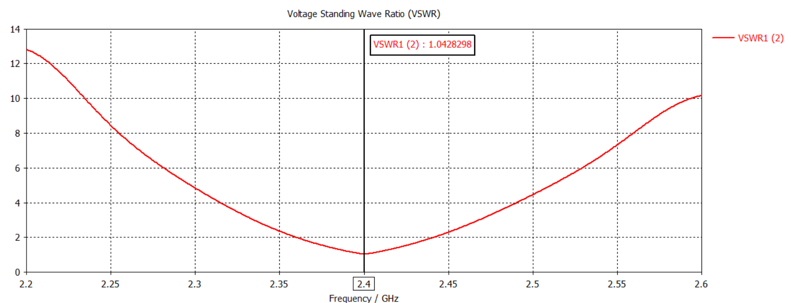

# 2.4 GHz Inset-Fed Microstrip Patch Antenna Design using CST Studio Suite

## Overview

This project presents the design, simulation, and optimization of a 2.4 GHz inset-fed rectangular microstrip patch antenna using CST Studio Suite.

The antenna was designed on an FR4 lossy substrate and optimized to achieve excellent impedance matching, low VSWR, and broadside radiation characteristics suitable for wireless communication applications operating in the 2.4 GHz ISM band.

---

## Software Used

* CST Studio Suite

---

## Antenna Parameters

| Parameter             | Value      |
| --------------------- | ---------- |
| Substrate Material    | FR4 Lossy  |
| Substrate Thickness   | 1.6 mm     |
| Patch Length (PL)     | 29.42 mm  |
| Patch Width (PW)      | 37.2 mm    |
| Substrate Length (SL) | 50 mm      |
| Substrate Width (SW)  | 60 mm      |
| Feed Type             | Inset Feed |
| Operating Frequency   | 2.4 GHz    |

---

## Simulation Results

| Parameter            | Value     |
| -------------------- | --------- |
| Resonant Frequency   | 2.40 GHz  |
| Return Loss (S11)    | -33.57 dB |
| VSWR                 | 1.04      |
| Directivity          | 6.37 dBi  |
| Realized Gain        | 2.57 dBi  |
| Radiation Efficiency | 41.4%     |
| Total Efficiency     | 41.4%     |

---

## Antenna Geometry

---

## S11 Parameter Plot

---

## VSWR Plot

---

## 3D Radiation Pattern

---

## Design Optimization

The antenna dimensions and substrate size were optimized to achieve:

* Resonance at 2.4 GHz
* Return loss below -30 dB
* VSWR close to 1
* Improved realized gain and directivity
* Broadside radiation pattern

The effect of substrate dimensions on antenna performance was analyzed during the optimization process.

---

## Applications

* Wi-Fi (2.4 GHz)
* IoT Devices
* Wireless Sensor Networks
* ISM Band Communication Systems
* Educational and Research Applications

---

## Conclusion

A 2.4 GHz inset-fed rectangular microstrip patch antenna was successfully designed and optimized using CST Studio Suite. The antenna achieved excellent impedance matching with a return loss of -33.57 dB and a VSWR of 1.04. The simulated directivity of 6.37 dBi and realized gain of 2.54 dBi demonstrate suitable radiation performance for wireless communication applications in the 2.4 GHz ISM band.

---

**Author:** Sarvesh B.V.

**Department:** Electronics and Communication (Advanced Communication Technology)

**Tool Used:** CST Studio Suite
